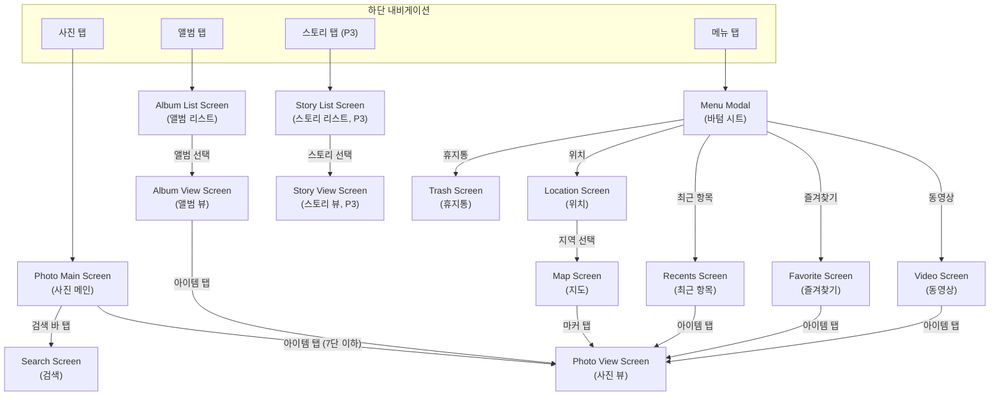
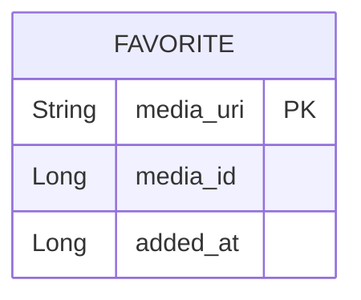

# 갤러리 앱 개발 계획서

작성일: 2026-04-10 / 버전: 1.2  
참조 명세서: `req/req_2026-04-10(1230).md`  
이전 버전: `plan_2026-04-10(1309).md`

> **v1.2 변경 사항 요약**
> - 시각적 디자인 와이어프레임 완성 (`visual/` 폴더 14개 파일, 시안 B — Material You Purple)
> - 스토리 뷰 기본 슬라이드 표시 시간 3초 확정 (story_view_wireframe.md)
> - 재생속도 선택지 확정: 0.5x / 1x / 1.5x / 2x

---

## 1. 기술 스택

| 분류 | 기술 | 설명 |
|------|------|------|
| 언어 | Kotlin | Android 공식 권장 언어 |
| UI | Jetpack Compose | 선언형 UI 툴킷, Material Design 3 기반 |
| 아키텍처 | MVVM | UI - ViewModel - Repository 레이어 분리 |
| 미디어 접근 | MediaStore API | 기기 로컬 사진/동영상 쿼리 |
| 이미지 로딩 | Coil | Compose 친화적 비동기 이미지 로더 |
| 비디오 재생 | ExoPlayer (Media3) | 구글 공식 미디어 재생 라이브러리 |
| 지도 | Google Maps SDK for Compose | GPS 메타데이터 기반 위치 마커 표시 |
| 상태 관리 | ViewModel + StateFlow | UI 상태 관리 및 생명주기 안전 처리 |
| 비동기 | Coroutines + Flow | 비동기 데이터 스트림 처리 |
| 로컬 DB | Room | 즐겨찾기 앱 자체 데이터 저장 (휴지통은 제외) |
| DI | Hilt | 의존성 주입, ViewModel·Repository 연결 |
| 내비게이션 | Navigation Compose | 화면 전환 및 딥링크 관리 |
| 디자인 시스템 | Material Design 3 | Dynamic Color, 다크/라이트 모드 지원 |
| 시크릿 관리 | secrets-gradle-plugin | Google Maps API Key를 local.properties에서 안전하게 관리 |

---

## 2. 화면 목록 및 설명

### 2-1. 하단 내비게이션 탭 구조

| 탭 인덱스 | 탭명 | 연결 화면 |
|-----------|------|-----------|
| 0 | 사진 | 사진 메인 스크린 |
| 1 | 앨범 | 앨범 리스트 스크린 |
| 2 | 스토리 | 스토리 리스트 스크린 (P3) |
| 3 | 메뉴 | 메뉴 모달 (바텀 시트) |

### 2-2. 화면 상세

#### Photo Main Screen (사진 메인)
- 기기 내 전체 사진·동영상을 날짜 단위 섹션으로 그룹화하여 표시
- LargeTopAppBar (Collapsing) + LazyColumn + StickyHeader 구조
- LazyVerticalGrid 썸네일: 핀치 줌으로 1.5단/3단/4단/7단/11단/20단 전환
  - 7단 이하: 실제 미디어 아이템 렌더링 → 탭 시 Photo View로 이동
  - 11단/20단: **저해상도 썸네일** 경량 렌더링 (가상 뷰) → 탭 시 핀치 아웃 효과만 적용
- 동영상 아이템 좌하단에 재생시간 배지 (반투명 오버레이)
- 상단 검색 바 (검색 스크린으로 이동)
- 다중 선택 모드: **롱프레스**로 진입 → 공유·삭제 액션 바 표시
- 와이어프레임: `visual/photo_main_wireframe.md`

#### Album List Screen (앨범 리스트)
- 기기 내 폴더 단위 앨범 목록 표시
- LazyVerticalGrid: 1단/2단/3단 전환 가능
- 각 앨범 카드: 커버 이미지 + 앨범명 + 미디어 개수
- 정렬 옵션: 이름순 / 최신순 / 항목 수 순
- 와이어프레임: `visual/album_list_wireframe.md`

#### Album View Screen (앨범 뷰)
- 선택된 앨범 내 미디어 그리드
- LazyVerticalGrid + AnimatedVisibility 서랍식 사이드 패널
- **서랍 열림/닫힘 트리거: 스와이프 제스처** (우측 엣지에서 좌향 스와이프로 열림)
- 서랍 닫힘 시 열 수: 1.5단/3단/4단/7단/12단 (5종)
- 서랍 열림 시 열 수: 1.5단/2단/3단/5단/9단 (5종)
- 마지막 단계(최소 축소 상태)에서 아이템 선택 시 핀치 아웃 효과 → 사진 뷰 전환 없음
- 다중 선택 모드: **롱프레스**로 진입
- 와이어프레임: `visual/album_view_wireframe.md`

#### Photo View Screen (사진 뷰)
- HorizontalPager로 좌우 스와이프 전환
- 핀치 줌 + 팬 제스처 지원
- 하단 썸네일 스트립: LazyRow
- 위로 드래그 시 AnchoredDraggable 상세정보 패널 표시
  - 파일명, 날짜, 파일 크기, 해상도, 위치 정보
- 하단 액션 바: 즐겨찾기(하트) / 편집(연필, 미구현) / AI(미구현) / 공유 / 삭제
- 동영상인 경우: ExoPlayer 재생 컨트롤 + 뮤트 버튼
- 와이어프레임: `visual/photo_view_wireframe.md`

#### Video Screen (동영상 특수 앨범)
- 기기 내 모든 동영상만 필터링하여 그리드 표시
- 사진 메인과 동일한 핀치 줌·다중 선택 지원
- 와이어프레임: `visual/video_wireframe.md`

#### Favorite Screen (즐겨찾기)
- Room DB에 URI로 즐겨찾기 마킹된 미디어 목록 표시
- 즐겨찾기 해제 시 목록에서 제거
- 와이어프레임: `visual/favorite_wireframe.md`

#### Recents Screen (최근 항목)
- 최근 추가된 미디어 필터 (30일 / 전체 기간 토글)
- MediaStore DATE_ADDED 기준 정렬
- 와이어프레임: `visual/recents_wireframe.md`

#### Trash Screen (휴지통)
- Android 11 (API 30) 이상: MediaStore `IS_TRASHED` 플래그로 OS 휴지통에 있는 항목만 표시
- **앱 자체적인 삭제 수행 없음** — "삭제 후 30일이 지나면 자동으로 영구 삭제됩니다" 안내 문구만 표시
- API 29~30 (API 30 미만): "이 Android 버전에서는 휴지통 기능을 지원하지 않습니다. 삭제 시 바로 영구 삭제됩니다." 문구 표시
- 와이어프레임: `visual/trash_wireframe.md`

#### Location Screen (위치)
- GPS 메타데이터 기반 국가/도시별 분류
- 지역별 대표 이미지 카드 목록
- GPS 메타데이터 없는 미디어는 목록에서 제외
- 와이어프레임: `visual/location_wireframe.md`

#### Map Screen (지도)
- Google Maps Compose 기반 지도 표시
- 미디어 위치 마커 클러스터링
- 마커 탭 시 미디어 미리보기 표시
- GPS 메타데이터 없는 미디어는 마커 미표시
- 와이어프레임: `visual/map_wireframe.md`

#### Search Screen (검색)
- 파일명 텍스트 검색
- 위치 기반 검색 (도시명)
- 미디어 타입 필터 (사진 / 동영상)
- 와이어프레임: `visual/search_wireframe.md`

#### Story List Screen (스토리 리스트) — P3
- 날짜·앨범 기반 자동 생성 스토리 목록
- 스토리 커버 이미지 가로 스크롤 (오른쪽 방향 흐름)
- 와이어프레임: `visual/story_list_wireframe.md`

#### Story View Screen (스토리 뷰) — P3
- 슬라이드쇼 자동재생 (기본 표시 시간: **3초**)
- 재생속도 조절: 0.5x / 1x / 1.5x / 2x
- 배경 음악 (앱 내 번들 음원)
- 와이어프레임: `visual/story_view_wireframe.md`

#### Menu Modal (메뉴 바텀 시트)
- 부가 메뉴 탭 선택 시 표시되는 모달
- 항목: 동영상 / 즐겨찾기 / 최근 항목 / 위치 / 공유 앨범 / 사진첩 정리 / 휴지통 / 설정
  - "공유 앨범", "사진첩 정리" → 탭 시 Toast: **"추후 구현 예정입니다."**
- 와이어프레임: `visual/menu_modal_wireframe.md`

---

## 3. 화면 흐름도



---

## 4. 폴더 구조

```
gallery-app/
├── app/
│   ├── src/main/
│   │   ├── AndroidManifest.xml
│   │   └── kotlin/com/yoshi0311/gallery/
│   │       ├── GalleryApplication.kt          # Hilt Application
│   │       ├── MainActivity.kt                # 진입점, NavHost 호스팅
│   │       │
│   │       ├── data/
│   │       │   ├── local/
│   │       │   │   ├── db/
│   │       │   │   │   ├── GalleryDatabase.kt
│   │       │   │   │   ├── dao/
│   │       │   │   │   │   └── FavoriteDao.kt
│   │       │   │   │   └── entity/
│   │       │   │   │       └── FavoriteEntity.kt
│   │       │   │   └── mediastore/
│   │       │   │       └── MediaStoreDataSource.kt
│   │       │   ├── model/
│   │       │   │   ├── MediaItem.kt           # 사진/동영상 공통 도메인 모델
│   │       │   │   ├── Album.kt
│   │       │   │   └── Story.kt               # P3
│   │       │   └── repository/
│   │       │       ├── MediaRepository.kt
│   │       │       ├── AlbumRepository.kt
│   │       │       ├── FavoriteRepository.kt
│   │       │       ├── TrashRepository.kt     # IS_TRASHED 쿼리만 담당
│   │       │       └── SearchRepository.kt
│   │       │
│   │       ├── di/
│   │       │   ├── DatabaseModule.kt
│   │       │   ├── MediaStoreModule.kt
│   │       │   └── RepositoryModule.kt
│   │       │
│   │       ├── ui/
│   │       │   ├── theme/
│   │       │   │   ├── Theme.kt
│   │       │   │   ├── Color.kt
│   │       │   │   └── Type.kt
│   │       │   ├── navigation/
│   │       │   │   ├── GalleryNavHost.kt
│   │       │   │   └── Screen.kt              # sealed class 라우트 정의
│   │       │   ├── screen/
│   │       │   │   ├── photomain/
│   │       │   │   │   └── PhotoMainScreen.kt
│   │       │   │   ├── albumlist/
│   │       │   │   │   └── AlbumListScreen.kt
│   │       │   │   ├── albumview/
│   │       │   │   │   └── AlbumViewScreen.kt
│   │       │   │   ├── photoview/
│   │       │   │   │   └── PhotoViewScreen.kt
│   │       │   │   ├── video/
│   │       │   │   │   └── VideoScreen.kt
│   │       │   │   ├── favorite/
│   │       │   │   │   └── FavoriteScreen.kt
│   │       │   │   ├── recents/
│   │       │   │   │   └── RecentsScreen.kt
│   │       │   │   ├── trash/
│   │       │   │   │   └── TrashScreen.kt
│   │       │   │   ├── location/
│   │       │   │   │   └── LocationScreen.kt
│   │       │   │   ├── map/
│   │       │   │   │   └── MapScreen.kt
│   │       │   │   ├── search/
│   │       │   │   │   └── SearchScreen.kt
│   │       │   │   ├── story/                 # P3
│   │       │   │   │   ├── StoryListScreen.kt
│   │       │   │   │   └── StoryViewScreen.kt
│   │       │   │   └── menu/
│   │       │   │       └── MenuModalSheet.kt
│   │       │   └── component/                 # 재사용 Composable
│   │       │       ├── MediaGrid.kt
│   │       │       ├── MediaThumbnail.kt
│   │       │       ├── VideoOverlay.kt
│   │       │       └── SelectionTopBar.kt
│   │       │
│   │       └── viewmodel/
│   │           ├── PhotoMainViewModel.kt
│   │           ├── AlbumListViewModel.kt
│   │           ├── AlbumViewViewModel.kt
│   │           ├── PhotoViewViewModel.kt
│   │           ├── VideoViewModel.kt
│   │           ├── FavoriteViewModel.kt
│   │           ├── RecentsViewModel.kt
│   │           ├── TrashViewModel.kt
│   │           ├── LocationViewModel.kt
│   │           ├── MapViewModel.kt
│   │           ├── SearchViewModel.kt
│   │           └── StoryViewModel.kt          # P3
│   │
│   └── build.gradle.kts
├── build.gradle.kts
├── settings.gradle.kts
└── local.properties                           # MAPS_API_KEY=... (Git 제외)
```

---

## 5. DB 스키마

> 서버 없는 로컬 전용 앱이므로 Room(SQLite) 테이블만 존재합니다.  
> MediaStore 미디어 자체는 DB에 저장하지 않고 MediaStore API로 실시간 쿼리합니다.  
> 휴지통은 OS의 `IS_TRASHED`를 그대로 활용하므로 별도 테이블 없음.

### 5-1. favorite (즐겨찾기)

| 컬럼명 | 타입 | 설명 |
|--------|------|------|
| media_uri | String (PK) | content:// URI 문자열 (식별자) |
| media_id | Long | MediaStore ID (참고용, 보조) |
| added_at | Long | 즐겨찾기 추가 시각 (Unix timestamp ms) |

> **URI 기반 식별 주의사항:** content URI는 기기 재스캔 시 드물게 변경될 수 있습니다.  
> 내부 저장소(Internal Storage)는 변경 가능성이 낮지만, 외장 SD카드 재삽입·전체 MediaStore 재스캔 시 무효화될 수 있습니다.  
> content hash는 중복 사진 오판 위험과 연산 비용이 높으므로 채택하지 않습니다.  
> 실용적 타협안: URI를 PK로, media_id를 보조 컬럼으로 보관. URI 조회 실패 시 media_id로 재시도하는 폴백 로직을 권장합니다.

---

## 6. ER 다이어그램



> 휴지통 테이블은 제거되었습니다. OS `IS_TRASHED` MediaStore 컬럼으로 처리합니다.

---

## 7. 서버 엔드포인트

> 이 앱은 서버가 없는 **완전 로컬 전용** 앱입니다.  
> 백엔드 API, REST Endpoint, WebSocket 등 네트워크 통신은 일체 없습니다.  
> 외부 연동은 Google Maps SDK (지도 타일 렌더링, API Key 필요) 만 해당됩니다.

---

## 8. Google Maps API Key 관리

`secrets-gradle-plugin` 방식을 채택합니다.

**설정 방법:**
1. `local.properties`에 `MAPS_API_KEY=실제키값` 추가 (`.gitignore`에 포함, Git에 커밋 안 됨)
2. `build.gradle.kts`에 플러그인 적용 → 키가 `BuildConfig.MAPS_API_KEY` 및 `AndroidManifest.xml` placeholder로 자동 주입

**`local.properties` 직접 참조 방식과의 차이:**

| 비교 항목 | local.properties 직접 참조 | secrets-gradle-plugin |
|-----------|---------------------------|----------------------|
| 설정 난이도 | 조금 더 복잡 (수동 파싱 필요) | 간단 (플러그인이 자동 주입) |
| Manifest 주입 | 수동 처리 필요 | 자동 |
| BuildConfig 노출 | 수동 처리 필요 | 자동 |
| Google 공식 권장 | — | ✅ |

> secrets-gradle-plugin이 설정 코드가 더 적고 Google 공식 권장 방식이므로 채택합니다.

---

## 9. 구현 단계 (Phase)

### Phase 1 — 기본 기능 (P1)
- [ ] 프로젝트 초기 설정 (Hilt, Navigation, Room, Coil, ExoPlayer, secrets-gradle-plugin)
- [ ] 권한 요청 흐름 (`READ_MEDIA_IMAGES`, `READ_MEDIA_VIDEO`, `ACCESS_FINE_LOCATION`)
- [ ] MediaStore 데이터 소스 구현
- [ ] Photo Main Screen (날짜 섹션 + 핀치 줌)
- [ ] Album List Screen
- [ ] Album View Screen (서랍 패널 포함)
- [ ] Photo View Screen (스와이프 + 상세정보 패널)
- [ ] 동영상 재생 (ExoPlayer)
- [ ] 특수 앨범: 동영상 / 최근 항목

### Phase 2 — 부가 기능 (P2)
- [ ] 즐겨찾기 (Room 연동, URI 기반)
- [ ] 휴지통 (IS_TRASHED MediaStore 쿼리, 안내 문구만 표시)
- [ ] 공유 기능 (Android Sharesheet)
- [ ] 검색 스크린
- [ ] 위치 스크린 + 지도 스크린 (Google Maps)

### Phase 3 — 선택 기능 (P3, 최후순위)
- [ ] 스토리 리스트 스크린
- [ ] 스토리 뷰 스크린 (슬라이드쇼 + 배경 음악)

---

## 10. 미확인 사항 체크리스트

### 10-1. 권한 및 OS 버전 대응
- [x] **Android 13 (API 33) 이상**은 `READ_MEDIA_IMAGES`/`READ_MEDIA_VIDEO` 사용, 그 이하(API 29~32)는 `READ_EXTERNAL_STORAGE` 사용
- [x] 삭제 시 `MediaStore.createDeleteRequest()` 사용 (RecoverableSecurityException보다 가볍고 표준적)
- [x] Android 14 (API 34) 부분 사진 접근(`READ_MEDIA_VISUAL_USER_SELECTED`) **지원 안 함**

### 10-2. 휴지통 구현 방식
- [x] API 30 이상: OS `IS_TRASHED` 활용, 앱에서 실제 삭제 수행 안 함 → "삭제 후 30일이 지나면 자동으로 영구 삭제됩니다" 안내만 표시
- [x] API 29: "이 Android 버전에서는 휴지통 기능을 지원하지 않습니다. 삭제 시 바로 영구 삭제됩니다." 문구 표시

### 10-3. 즐겨찾기 저장 방식
- [x] URI 기반 식별 채택 (content hash 미채택). media_id를 보조 폴백으로 보관.

### 10-4. Google Maps
- [x] `secrets-gradle-plugin` 방식으로 API Key 관리
- [x] GPS 메타데이터 없는 미디어는 위치 스크린·지도 스크린 목록에서 제외

### 10-5. 스토리 자동 생성 로직 (P3)
- [x] 기본 슬라이드 표시 시간: **3초**
- [x] 재생속도 선택지: **0.5x / 1x / 1.5x / 2x**
- [ ] 스토리 생성 기준(날짜 범위, 최소 미디어 개수 등) 미정의 — **P3 구현 전에 정의 필요**
- [ ] 배경 음악 번들 음원 목록 미정 — **P3 구현 전에 확정 필요**
- [ ] 마지막 슬라이드 이후 동작 (반복 or 종료) 미정 — **P3 구현 전에 정의 필요**

### 10-6. 성능 및 기타
- [x] 핀치 줌 11단/20단 가상 뷰: **저해상도 썸네일** 렌더링
- [x] 앨범 뷰 서랍 패널 트리거: **스와이프 제스처** (우측 엣지 → 좌향)
- [x] 다중 선택 모드 진입: **롱프레스**
- [x] "공유 앨범", "사진첩 정리" 탭 시: Toast("추후 구현 예정입니다.")
- [x] 앱 아이콘: 기본 이미지 / 앱 이름: `갤러리` / 패키지명: `com.yoshi0311.gallery`
